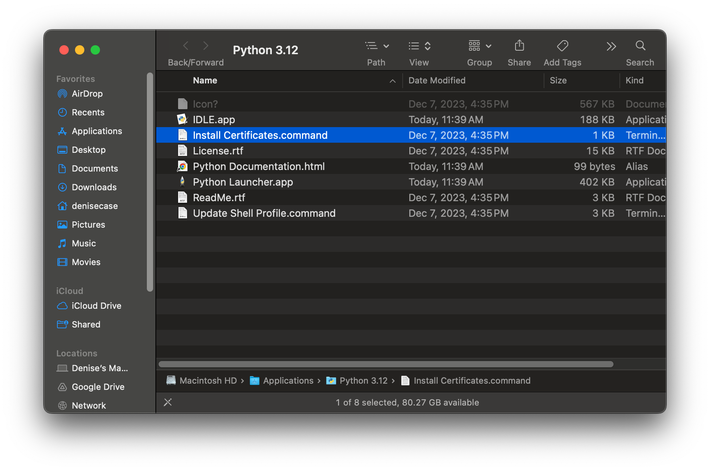
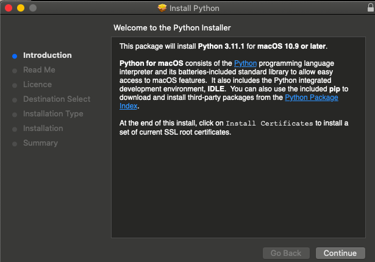
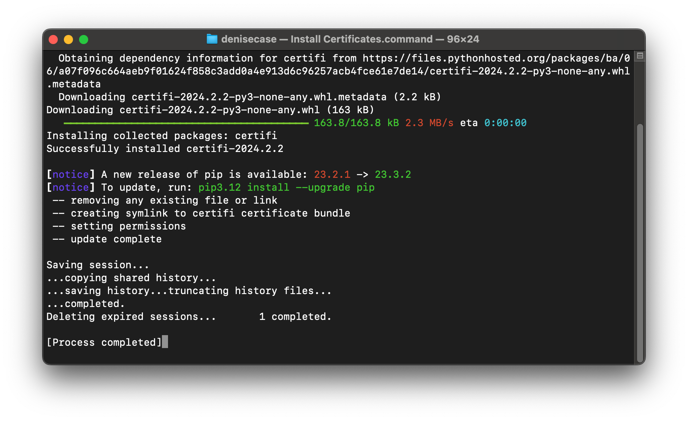

# MACS.md

Seaborn fetches datasets from the web.
Newer Macs don't have the required SSL Certificate functionaliy installed by default.
There is a post-installation process that must be run.

## Install Certificates: After Python Installation

After installing a recent version of Python on a Mac,
you'll see something like this.



After a Python installation, it tells us there is one more step to set things up.



## Install Certifications: As Needed

If we didn't run the command when we installed Pythoh,
we can run it as needed.
Open the Python folder in Finder and find the "Install Certifications.command" file. 


Run the file. I double-clicked on the "Install Certifications.command" file to run it.
After successful installation, close the associated terminal window and you should be good.



## Inform Your Local Project Virtual Environment

Assuming you've created a local project virtual environment with the following command run from your root project directory:

`venv .venv`

And activated the local project virtual environment with:

`source .venv/bin/activate`

And upgraded pip if recommended with:

`python3 -m pip upgrade pip`

And installed seaborn with:

`python3 -m pip install seaborn`

## Start a New Terminal Window

Close the terminals you're working with.
Open a new terminal window in your root project directory and activate your local project virtual environment with: 

`source .venv/bin/activate`

## Test the DataSet

In your project Python notebook, the following code should now run without error:

```python
import seaborn as sns
sns.load_dataset('iris')
```
